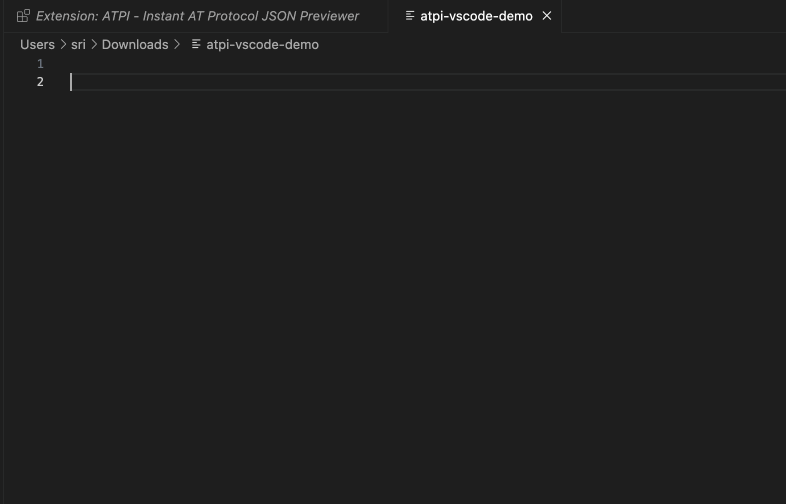

# ATPI for VS Code

Resolve and explore AT Protocol URLs directly in Visual Studio Code. This extension integrates the [ATPI](https://github.com/sriganesh/atpi-npm) tool to provide instant access to AT Protocol data while you code.



## Features

### Instant URL Resolution
- **Hover** over any `at://` URL to see resolved JSON data
- **Click** CodeLens links to resolve URLs with one click
- **Command Palette** integration for quick resolution

### Smart Autocompletion
Get intelligent suggestions for AT Protocol collections:
```
at://did:plc:example/ → app.bsky.feed.post
                      → app.bsky.actor.profile
                      → app.bsky.graph.follow
```

### Multiple Resolution Modes
- **Local Mode**: Direct connection to PDS servers (faster, no dependencies)
- **Remote Mode**: Via atpi.at service (simpler, works behind firewalls)
- **Auto Mode**: Try local first, fallback to remote

### Rich Data Viewer
- Syntax-highlighted JSON display
- Webview panel with search and export
- Tree view for easy navigation
- Copy data with one click

### Developer Tools
- Batch URL resolution
- History tracking
- Status bar mode indicator

## Installation

1. Open VS Code
2. Press `Ctrl+P` / `Cmd+P`
3. Type `ext install atpi-vscode`
4. Press Enter

## Usage

### Basic Resolution

1. **Hover Method**: Simply hover over any AT Protocol URL in your code
   ```javascript
   const postUrl = "at://did:plc:7gm5ejhut7kia2kzglqfew5b/app.bsky.feed.post/3lszcx7zf622q";
   // Hover over the URL above to see the data
   ```

2. **Command Method**: 
   - Select an AT URL or place cursor on it
   - Press `Ctrl+Shift+2` / `Cmd+Shift+2` (think @ for AT Protocol!)
   - Or use Command Palette: "ATPI: Resolve AT Protocol URL"

3. **CodeLens Method**: Click the "Resolve" link that appears above AT URLs

### Autocompletion

Type an AT Protocol identifier followed by `/` to get collection suggestions:

```javascript
const url = "at://alice.bsky.social/" // Press Ctrl+Space after the slash
```

### Batch Resolution

To resolve multiple URLs at once:
1. Open a file containing AT URLs
2. Run "ATPI: Batch Resolve URLs" from Command Palette
3. Select which URLs to resolve
4. View all results in the panel

### Changing Resolution Mode

Click the ATPI status bar item (bottom right) to switch between:
- Local (default)
- Remote
- Auto

## Configuration

Configure ATPI in VS Code settings:

```json
{
  // Resolution mode: "local", "remote", or "auto"
  "atpi.resolutionMode": "local",
  
  // Request timeout in milliseconds
  "atpi.timeout": 30000,
  
  // Base URL for remote resolution
  "atpi.remoteBaseUrl": "https://atpi.",
  
  // Enable caching
  "atpi.enableCache": true,
  
  // Cache duration in milliseconds
  "atpi.cacheDuration": 3600000,
  
  // Show CodeLens above AT URLs
  "atpi.showCodeLens": true
}
```

## Keyboard Shortcuts

- `Ctrl+Shift+2` / `Cmd+Shift+2`: Resolve AT Protocol URL (same as @ key)


## Requirements

- VS Code 1.85.0 or higher

## Known Issues

- Cache is cleared when VS Code restarts
- Some AT Protocol collections may not appear in autocompletion
- Large JSON responses may be truncated in hover tooltips

## Contributing

Found a bug or have a feature request? Please open an issue on [GitHub](https://github.com/sriganesh/atpi-vscode).


## License

This extension is licensed under the MIT License. See the [LICENSE](LICENSE) file for details.

---

**Built by ATProto Builders**